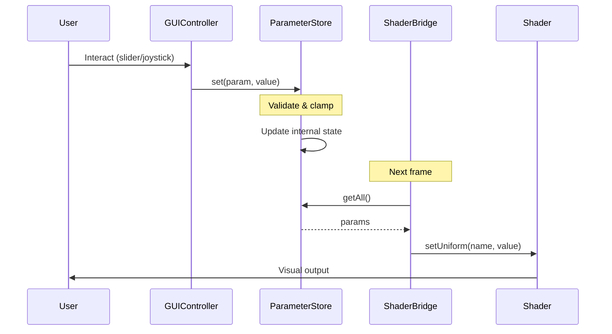
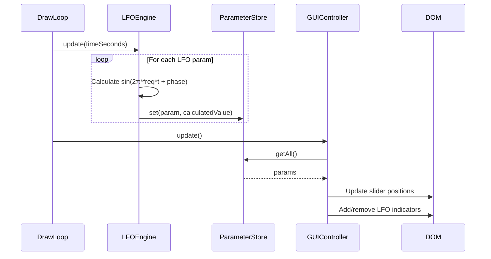
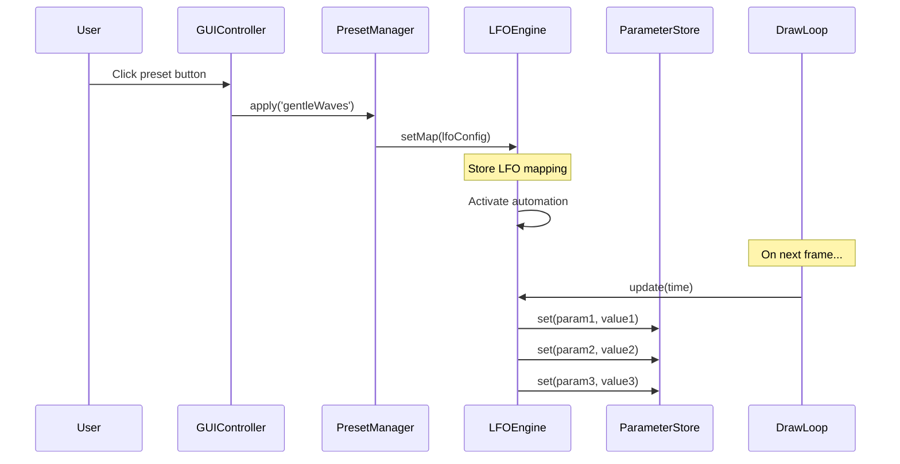
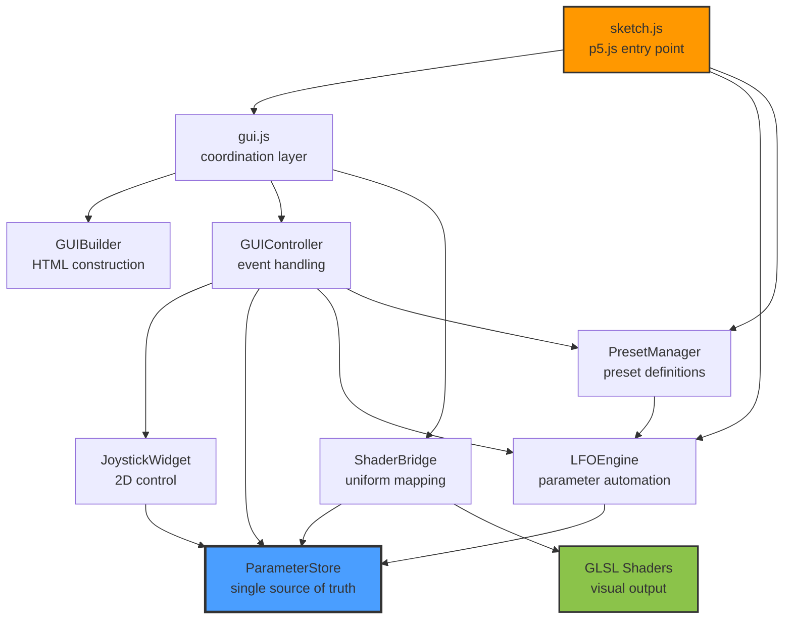

# Architecture Documentation

## Overview

This is a modular p5.js spatial FM synthesizer with WebGL shader visualization. The codebase follows a clean separation of concerns with distinct layers for data management, UI, and rendering.

## Project Structure

```
spatial_synthesizer_full/
├── src/
│   ├── core/              # Business logic and data management
│   │   ├── parameters.js  # ParameterStore: Centralized state
│   │   ├── lfo-engine.js  # LFOEngine: Parameter automation
│   │   └── presets.js     # PresetManager: Preset definitions
│   ├── ui/                # User interface components
│   │   ├── gui-builder.js    # GUIBuilder: HTML construction
│   │   ├── gui-controller.js # GUIController: Event handling
│   │   └── joystick-widget.js # JoystickWidget: 2D control
│   └── rendering/         # Graphics pipeline
│       └── shader-bridge.js  # ShaderBridge: Uniform mapping
├── gui.js           # GUI initialization and API
├── sketch.js        # p5.js main sketch
├── landing.js       # Landing page interaction
├── fm.frag          # Fragment shader (GLSL)
└── shader.vert      # Vertex shader (GLSL)
```

## Architecture Layers

### Core Layer (`src/core/`)

**Responsibilities**: Data management, validation, and business logic

#### ParameterStore (`parameters.js`)
- Single source of truth for all synthesizer parameters
- Validates and clamps values to acceptable ranges
- Provides get/set API with change notification
- No UI or rendering dependencies

**Key Methods**:
- `get(key)` - Retrieve parameter value
- `set(key, value)` - Update parameter with validation
- `getAll()` - Get all parameters as object
- `subscribe(callback)` - React to parameter changes

#### LFOEngine (`lfo-engine.js`)
- Manages Low Frequency Oscillator parameter automation
- Calculates sinusoidal modulation: `value = center + amplitude * sin(2π * frequency * time + phase)`
- Updates ParameterStore based on active LFO map
- No UI dependencies

**Key Methods**:
- `setMap(lfoMap)` - Activate LFO automation
- `update(timeSeconds)` - Update parameters for current time
- `clear()` - Return to manual mode
- `isParameterControlled(param)` - Check if param is automated

#### PresetManager (`presets.js`)
- Stores preset definitions as data
- Applies presets via LFOEngine
- Tracks currently active preset
- Makes it easy to add new presets

**Key Methods**:
- `apply(presetName)` - Activate preset
- `getCurrent()` - Get active preset name
- `list()` - Get all preset names

### UI Layer (`src/ui/`)

**Responsibilities**: User interface construction and interaction

#### GUIBuilder (`gui-builder.js`)
- Constructs HTML structure for controls
- Pure HTML generation, no event handling
- Creates sections: presets, sliders, joystick, dance controls
- Builds accessibility live region

**Key Methods**:
- `buildHTML(params)` - Generate complete GUI HTML
- `createLiveRegion()` - Create accessibility element

#### GUIController (`gui-controller.js`)
- Manages GUI state and event handling
- Syncs UI with ParameterStore
- Updates LFO-controlled visual indicators
- Handles toggle, presets, and parameter changes

**Key Methods**:
- `initialize()` - Attach all event listeners
- `update()` - Sync GUI with current state
- `setPreset(name)` - Apply preset and update UI
- `changeSpeed(delta)` / `changeIntensity(delta)` - Modify discrete levels

#### JoystickWidget (`joystick-widget.js`)
- Reusable 2D joystick control
- Handles mouse, touch, and keyboard input
- Updates two parameters (X/Y) in ParameterStore
- Visual feedback for LFO-controlled state

**Key Methods**:
- `draw()` - Render joystick on canvas
- `isLFOControlled()` - Check if either axis is automated

### Rendering Layer (`src/rendering/`)

**Responsibilities**: Graphics pipeline and shader communication

#### ShaderBridge (`shader-bridge.js`)
- Maps ParameterStore values to GLSL uniforms
- Handles coordinate transformations
- No parameter manipulation, only reading and mapping

**Key Methods**:
- `setUniforms(shader, width, height, timeMillis)` - Set all shader uniforms

### Application Layer (Root Directory)

#### gui.js
- Initializes modular architecture
- Creates instances of all modules
- Provides API for sketch.js
- Maintains backwards compatibility globals

**Key Functions**:
- `setupGUI()` - Initialize all UI modules
- `updateGUI()` - Called from draw loop
- `setShaderUniforms()` - Bridge to rendering
- `setPreset()`, `changeSpeed()`, `changeIntensity()` - Wrappers for HTML onclick

#### sketch.js
- p5.js application entry point
- Loads shaders in `preload()`
- Initializes LFO and preset systems in `setup()`
- Main render loop in `draw()`
- Handles fullscreen and screenshot interactions

**p5.js Lifecycle**:
1. `preload()` - Load vertex and fragment shaders
2. `setup()` - Initialize canvas, LFO engine, preset manager, GUI
3. `draw()` - Update LFOs → sync params → update GUI → set uniforms → render

## Data Flow

### Parameter Update Flow



### LFO Animation Flow



### Preset Activation Flow



## Design Patterns

### IIFE Module Pattern
All modules use Immediately Invoked Function Expressions for encapsulation:
```javascript
const ModuleName = (function () {
  class ModuleName {
    // ...
  }
  return ModuleName;
})();
```

**Why**: Provides module-like encapsulation without requiring a build system.

### Separation of Concerns
- **ParameterStore**: State management only
- **LFOEngine**: Automation logic only
- **GUIBuilder**: HTML construction only
- **GUIController**: Event handling only
- **ShaderBridge**: Rendering only

**Why**: Each module has a single, well-defined responsibility, making the code easier to understand, test, and modify.

### Backwards Compatibility
Legacy globals maintained during transition:
- `params` - Parameter object for sketch.js
- `activeLFOMap` - Exposed for external reference
- Wrapper functions for HTML onclick handlers

**Why**: Allows incremental refactoring with working code at each step.

## Module Dependencies



## Adding New Features

### Adding a New Parameter

1. **Add to ParameterStore** (`gui.js`):
   ```javascript
   const parameterStore = new ParameterStore({
     // ... existing params
     newParam: 0.5,
   });
   ```

2. **Add to ParameterStore definitions** (`src/core/parameters.js`):
   ```javascript
   _buildDefinitions() {
     return {
       // ... existing definitions
       newParam: { min: 0, max: 1, default: 0.5 },
     };
   }
   ```

3. **Add GUI control** (`src/ui/gui-builder.js`):
   ```javascript
   <input type="range" id="newParam" min="0" max="1" step="0.01" value="${params.newParam}">
   ```

4. **Add event listener** (`src/ui/gui-controller.js`):
   ```javascript
   controls.push({ id: 'newParam', param: 'newParam' });
   ```

5. **Add shader uniform** (`src/rendering/shader-bridge.js`):
   ```javascript
   shader.setUniform('u_newParam', params.newParam);
   ```

6. **Use in shader** (`fm.frag`):
   ```glsl
   uniform float u_newParam;
   ```

### Adding a New Preset

1. **Add to PresetManager** (`src/core/presets.js`):
   ```javascript
   this._presets = {
     // ... existing presets
     newPreset: {
       carrierFreqX: { frequency: 0.3, amplitude: 0.4, center: 0.6, phase: 0 },
       // ... other LFO-controlled params
     },
   };
   ```

2. **Add button** (`src/ui/gui-builder.js`):
   ```javascript
   <button onclick="setPreset('newPreset')" class="preset-btn" data-preset="newPreset">
     NEW PRESET
   </button>
   ```

3. **Add wrapper function** (`sketch.js`):
   ```javascript
   function newPreset() {
     presetManager.apply('newPreset');
   }
   ```

## Key Principles

1. **No Direct DOM Manipulation in Core**: Core modules never touch the DOM
2. **Single Source of Truth**: ParameterStore is the only place parameter values are stored
3. **Unidirectional Data Flow**: Parameters flow from ParameterStore → UI/Shaders
4. **Modular Independence**: Each module can be understood in isolation
5. **Testability**: Pure functions and clear dependencies make testing straightforward

## Performance Considerations

- **Draw Loop**: Runs at 60fps, keep operations minimal
- **LFO Updates**: Only active when preset is applied
- **GUI Updates**: Only updates visible elements that changed
- **Joystick**: Canvas rendering optimized for 70x70px size
- **Shader**: All heavy computation happens in GPU via fragment shader

## Browser Compatibility

- Requires WebGL support for shader rendering
- Modern ES6+ JavaScript (no transpilation)
- No build step required
- Works best on desktop with keyboard and mouse
- Mobile support via landing page redirect
